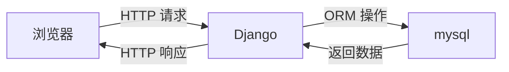
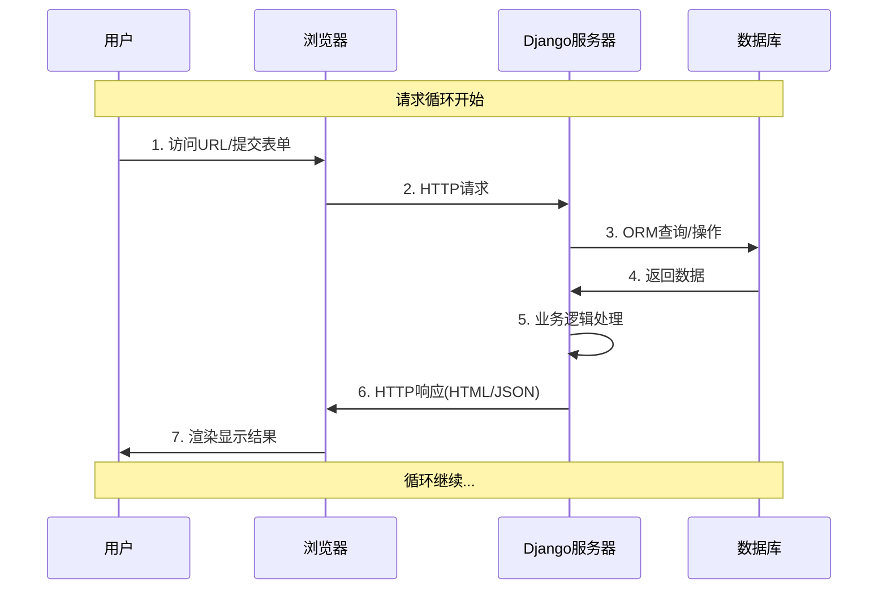
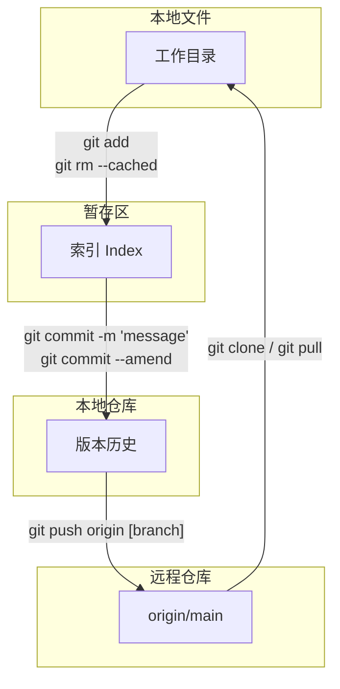

# Django文件使用和git上传文件说明
## 一、使用flask快速塔建一个web
- 安装flask  
`pip install flask`
- 创建一个app.py文件
```python
from flask import Flask,render_template
app = Flask(__name__)
# 创建了网址 /show/info 和 函数index 的对应关系
# 以后用户在浏览器上访问 /show/info，网站自动执行 index
@app.route("/show/info")
def index():
    return "成都东软学院"
    #return render_template("index.html")
if __name__ == '__main__':
    app.run()
```
- 创建一个templates文件夹，创建一个index.html文件  
&emsp;&emsp;就可以访问了
***
## 二、使用Django来创建一个web
- 安装Django
`pip install Django`
- 创建一个项目
下面过程是该教师项目的，可以的用conda来安装整理
- 打开终端
- 执行命令创建项目  
`"...\django-admin.exe" startproject `
```
#如果python313\scripts 已加载环境变量。
django-admin startproject 项目名称
- 默认文件介绍
django1
manage.py  [项目的管理、启动项目、创建app、数据管理]【不要动】【常常用】
django1
init.py
settings.py  [项目配置] 【常常修改】
uris.py  [URL和函数的对应关系] 【常常修改】
asgi.py  [接受网路请求]【不要动】
wsgi.py [接受网路请求]【不要动】
```
下面图像描述了项目结构:  


### 创建app
教程网站： https://www.runoob.com/django/django-project-intro.html  
在项目中创建app
`python manage.py startapp app名称`
- 创建app后，在app的setting.py中添加app名称
- 创建app的urls.py文件来编写app的url和函数的对应关系
- 创建app的views.py文件来编写app的函数
- 创建app的models.py文件来编写app的数据模型
- 创建app的admin.py文件来编写app的数据模型
### 运行项目
`python manage.py runserver`  
如果运行成功，访问 http://127.0.0.1:8000/  
访问 http://127.0.0.1:8000/app名称/
可以建立html文件，在templates文件夹中
- 创建app的templates文件夹，创建app的html文件  


- 创建app的static文件夹，创建app的css、js、img文件作为静态文件  

### Django、数据库和浏览器的关系和流程

流程图  


### 模板语法
- 循环
```html

<span>{{ item }}</span>

```
- 字典
```html
{{n3}}
{{n3.name}}


<ul>
    
    <li>{{k}}:{{v}}</li>
    
</ul>
```
- 判断语句
```html

<span>{{n1}}</span>

<span>{{n1}}</span>

<span>{{n1}}</span>
```
- 占位符
`error_msg`
### 请求与响应
浏览器在访问网页时，会向服务器发送请求，服务器会返回响应，浏览器会接收响应，并显示页面并且存储数据。
#### 1.请求
```
#request封装了用户发送的请求信息
#1.获取请求方式GET、POST
print(request.method)
#2.url上传递值 /something/?n1=123&n2=456
print(request.GET)
#3.获取请求体中的提交数据
print(request.post)

```
#### 2.响应
```
#1.响应HTTpResponse("返回的内容")，内容字符串返回给请求者
return HttpResponse("返回的内容")
#2.响应读取HTMl的 文件-->字符串，返回给用户浏览器
return render(request,"index.html")
#3.重定向
return redirect("https://www.baidu.com")
```
## 三.mySQL安装与连接
(主要介绍mysql的安装与连接)
### 安装mysql
#### 自己安装版本
可以访问官网下载安装mysql，默认安装
然后配置mysql，加入环境变量中
选择ui界面还是命令行界面  
ui界面：datagrid软件来访问数据库（数据库管理软件）  
命令行界面：mysql -u root -p
#### 配置mysql8.4.5
然后配置mysql中的my.ini文件，把文件bin加入环境变量中  
其配置文件如下：
```
[mysqld]
port = 3306
basedir = E:\programming_software\pycharm\front\mysql-8.4.5-winx64

datadir = E:\programming_software\pycharm\front\mysql-8.4.5-winx64\\data
```
然后打开管理员身份打开命令行界面
其方法如下
1. 通过开始菜单打开命令行界面
   - 点击开始按钮或 `win`键
   - 输入 `cmd` 或 `命令提示符`
   - 在搜索结果中右键点击"命令提示符"
   - 选择"以管理员身份运行"
2. 通果运行对话框
   - 按 `Win + R` 打开运行对话框
   - 输入 `cmd`
   - 按 `Ctrl + Shift + Enter`（而不是直接按回车）  

运行 `mysqld  --initialize-insecure`生成data文件夹(数据存放文件夹)  
然后运行 `mysqld`启动服务器  
制作成windows服务，服务来进行关闭和开启  
创建服务器`mysqld --intall mysql184`  
启动和关闭服务
```
net start mysql184 （启动）
net stop mysql184 （关闭）
```
删除制作服务`sc delete mysql`  
连接mysql使用`mysql -u root -p`
其常用的mysql语法在datagrid软件中的`mysql使用说明.md`中查看  
若是修改密码，则使用`alter user 'root'@'localhost' identified by '你要修改的密码';`
## 四.Django中使用mysql
### 安装包
`pip install mysqlclient`
### ORM
数据库ORM简介：  
ORM（对象关系映射，Object-Relational Mapping）是一种技术，
用于在面向对象编程语言（如Python、Java）和关系型数据库（如MySQL、PostgreSQL）之间建立映射关系。
它通过将数据库表映射为类，表中的记录映射为对象，使开发者可以使用面向对象的方式操作数据库，而无需直接编写SQL语句。

### 在pycharm中的Django中使用mysql
更新settings.py文件：
打开settings.py文件，找到DATABASES变量，并配置MySQL数据库的相关信息： 
```
DATABASES = {
    'default': {
        'ENGINE': 'django.db.backends.mysql',
        'NAME': 'django1',  # 数据库名字
        'USER': 'root',
        'PASSWORD': '你设置的密码',
        'HOST': '127.0.0.1',  # lockhost
        'PORT': 3306,
    }
}
```
创建app1的models.py文件中创建数据模型
```
class Userinfo(models.Model):
    name = models.CharField(max_length=32)
    password = models.CharField(max_length=64)
    age = models.IntegerField(default=2)
```
### 迁移
装包
`python -m pip install Pillow`
django 允许外部ip访问服务  
```
python manage.py makemigrations
python manage.py migrate
```
可以把数据迁移到mysql中如代码中：
```
def orm(request):
    Userinfo.objects.create(name="lin",password="123",age=18)
    Userinfo.objects.create(name="lin1", password="1213", age=10)
    Userinfo.objects.create(name="lin2", password="1233", age=15)
```
在mysql中查看数据
```
use django1;
desc app1_userinfo;
select * from app1_userinfo ;
```
分别图像为:

| Field | Type | Null | Key | Default | Extra |
| :--- | :--- | :--- | :--- | :--- | :--- |
| id | bigint | NO | PRI | null | auto\_increment |
| name | varchar\(32\) | NO |  | null |  |
| password | varchar\(64\) | NO |  | null |  |
| age | int | NO |  | null |  |

| id | name | password | age |
| :--- | :--- | :--- | :--- |
| 1 | lin | 123 | 18 |
| 2 | lin1 | 1213 | 10 |
| 3 | lin2 | 1233 | 15 |

如何将mysql数据库的数据导入到app1/views.py中
在app1/views.py中编写代码，创建一个函数，返回数据
然后编写视图html文件，显示数据
```

        <tr>
            <td>{{ student.id }}</td>
            <td>{{ student.name }}</td>
            <td>{{ student.password }}</td>
            <td>{{ student.age }}</td>
            <td>{{ student.grade }}</td>
        </tr>
    
```
其结果如下:  

### django中的增添查改删
其代码在app1/views.py中  
```
# 增
文件名.objects.create(字段名=字段值,字段名=字段值)
# 改
文件名.objects.filter(字段名=字段值).update(字段名=字段值)
# 查
文件名.objects.filter(字段名=字段值)
# 删
文件名.objects.filter(字段名=字段值).delete()
```
### 内网穿透
这是一个关于 ngrok 命令行工具的详细说明。  
ngrok 是一个非常流行的工具，
它的主要功能是将你本地计算机上的网络服务（比如一个网站或一个应用）临时暴露到公网上，
让你获得一个公共的、可以从互联网访问的 URL 地址。
`ngrok http 网址:8000`
进行内网穿透
### 案列
1. 展示用户列表
  - 获取所有用户数据
  - 模块语法填入html
  - 返回前端
```
def user_list(request):
    student_queryset = models.Userinfo.objects.all()
    return render(request,"user_list.html",{"user_list": student_queryset})
```
2. 添加用户
   - get,看到页面，输入内容
   - post,提交数据到数据库
```
def user_add(request):#添加
    if request.method == 'GET':
        return render(request,"user_add.html")
    name = request.POST.get("name")
    password = request.POST.get("pwd")
    age = request.POST.get("age")
    models.Userinfo.objects.create(name=name,password=password,age=age)
    return redirect(reverse('用户列表'))

```
3. 删除用户
```
http://127.0.0.1:8000/info/delete/?nid=1
def user_del(request):
    nid = request.GET.get("nid")
    UserInfo.objects.filter (id=nid) .deleteO)
    return redirect('/user/list')

```
## github本地仓库
### 1. git
Git是目前世界上最先进的分布式版本控制系统。  
工作原理 / 流程图：

Workspace：工作区  
Index / Stage：暂存区  
Repository：仓库区（或本地仓库）  
Remote：远程仓库  
#### 安装 Git
安装成功后，在命令行输入 `git --version` 命令，查看版本号。
有git bash 和 Git GUI 两种图形化界面
git config --global user.name "你的用户名"  
git config --global user.email "你的邮箱"  
git详细使用说明文档 
https://blog.csdn.net/u011535541/article/details/83379151  
gitee 上传说明  
https://blog.csdn.net/qq_51618777/article/details/124420589
### 2. github
GitHub是一个托管Git仓库的网站，GitHub上存放着GitHub上所有开源项目的代码。  
由于github不稳定,需要vpn,所以用gitee来代替流程:
1. 创建一个gitee账号
2. 了解页面的功能

   1. 代码
   2. issues（错误报告）
   3. pull request（合并代码）
   4. 分支、标签
   5. 代码下载
   6. readme （介绍）
   7. License （版权）
3. 创建仓库

4. 本地仓库初始化
用git bash先配置个人信息  
```
git config --global user.name "你的用户名"  
git config --global user.email "你的邮箱" 
```
然后配置公钥，并复制到远程仓库中
``` 
mkdir ~.ssh
ssh-keygen -t rsa -C "你的邮箱"
cat id_rsa.pub
```
或者在c盘中有个.ssh文件夹，里面有id_rsa.pub文件，拷贝里面的内容到gitee的ssh中  


  
查看仓库状态
- git status （显示当前仓库状态）
- git log （显示提交记录）

5. 创建项目
使用git bash进入项目目录，并初始化项目
并添加项目
``` 
git init (初始化项目)

git remote add origin 仓库 (添加远程仓库)

git pull origin master(拉取远程仓库)
```
6. git常用命令  


如何使用pycharm创建github仓库  
其步骤如下：
https://blog.csdn.net/m0_67839004/article/details/136078215  
先在github中创建仓库  
然后获取github的url
返回pycharm中拉取仓库
创建项目


