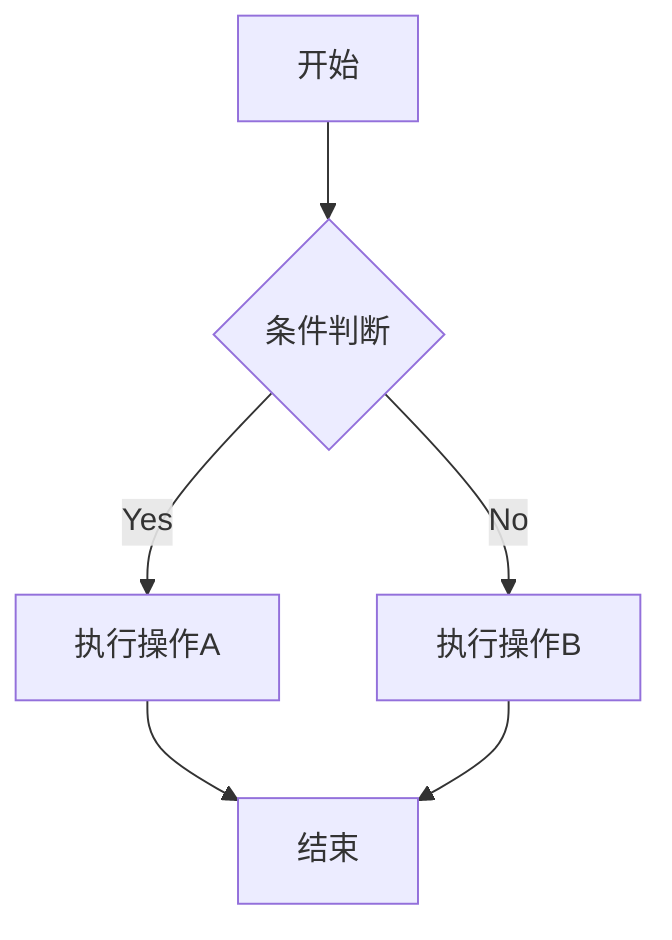
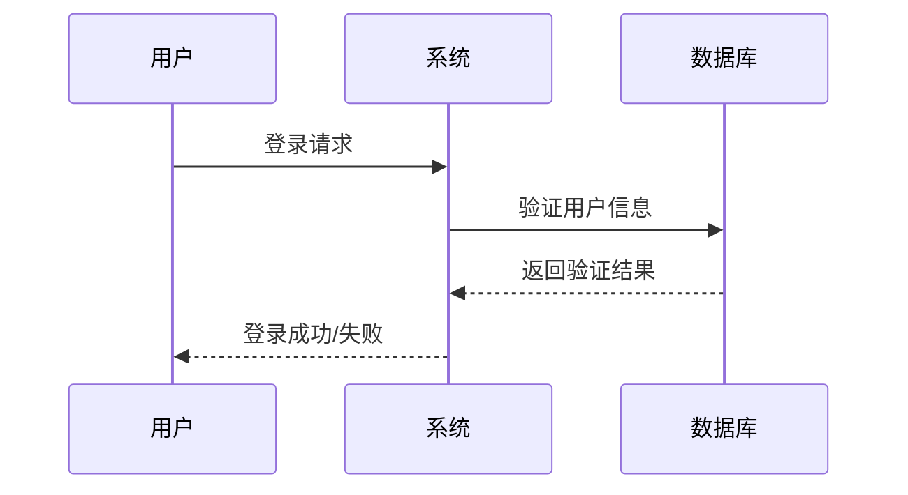
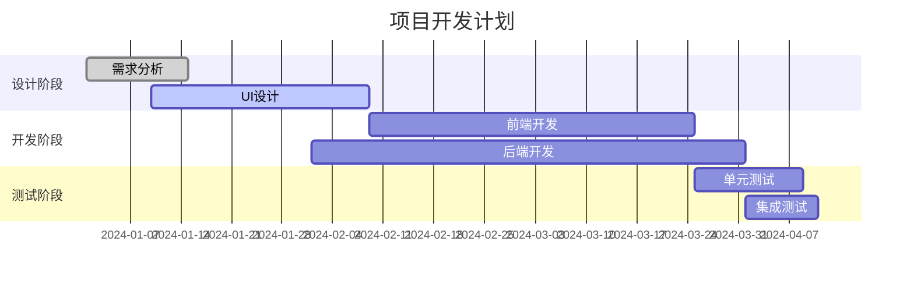
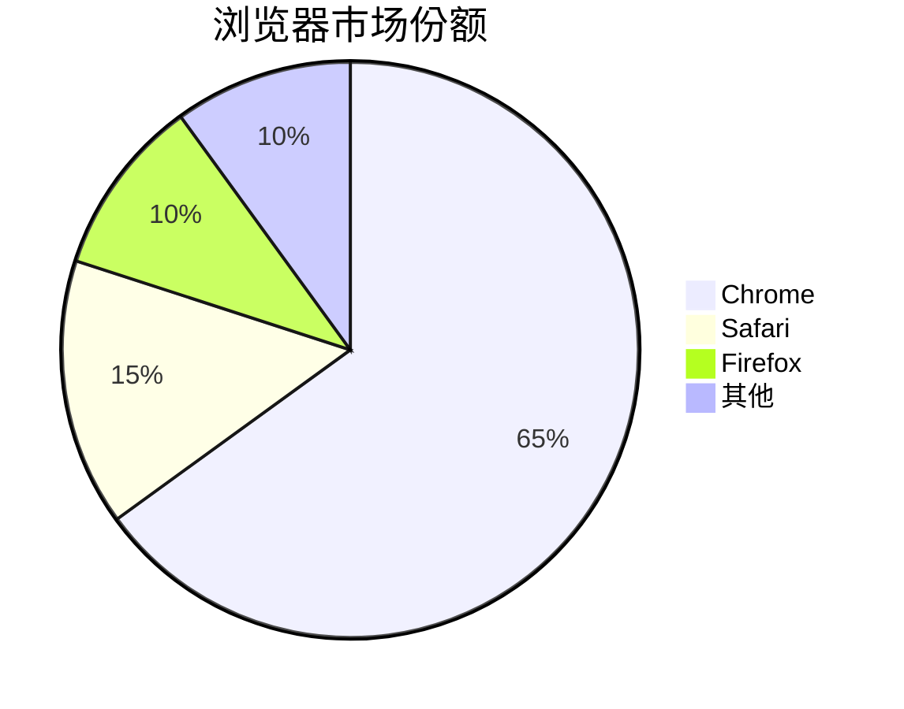
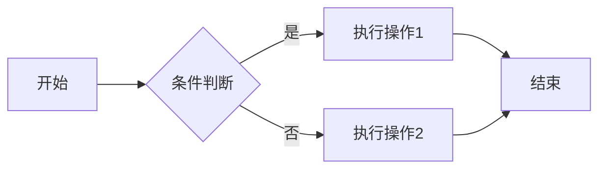
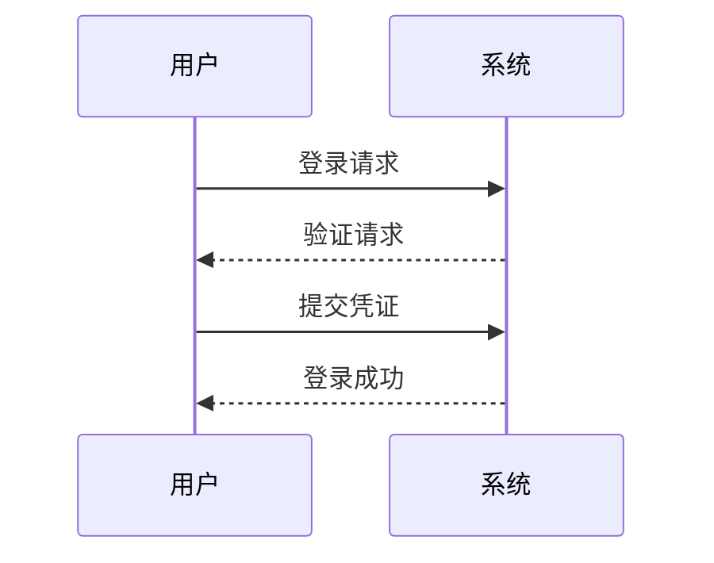
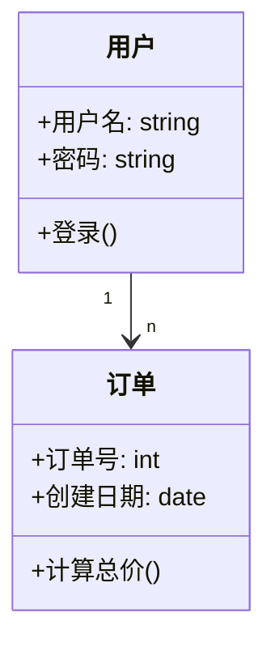
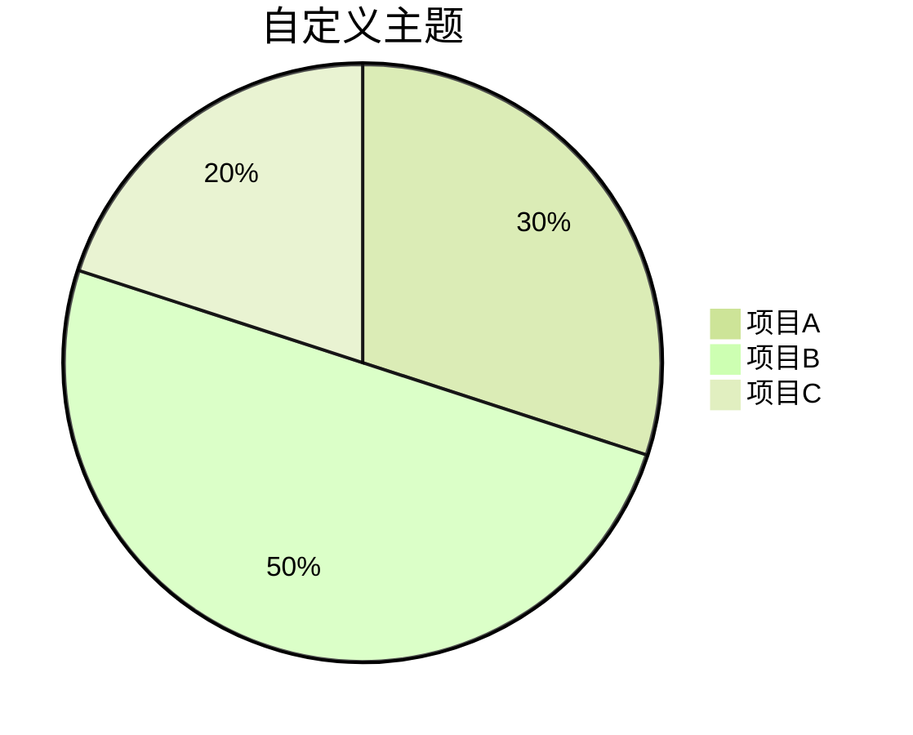
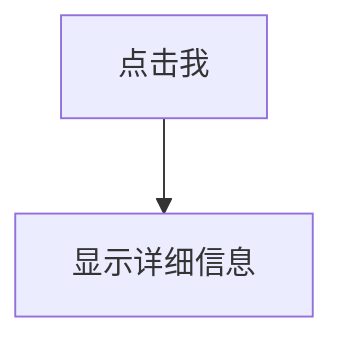

# Markdown文件使用说明
https://zhuanlan.zhihu.com/p/342282274
## 1、主要代码
&emsp;&emsp;常用的代码符号： 
***
&emsp;&emsp; #一级标题
***
> 引用:>文字
***
&emsp;&emsp;这是文字倾斜*文字列表*  
&emsp;&emsp;`*文字列表*`
***
&emsp;&emsp;这是文字加粗**文字列表**  
&emsp;&emsp;`**文字列表**`
***
&emsp;&emsp;这是分割线:***  
&emsp;&emsp;`***`  
&emsp;&emsp;可以使用---  `---`  
***
&emsp;&emsp;下面无序列表：
- 列表1
- 列表2
- 列表3
```
- 列表1
- 列表2
- 列表3
```
***
下面有序列表：
1. 列表1
2. 列表2
3. 列表3
```
1. 列表1
2. 列表2
3. 列表3
```
***
文字居中  
<center>此行文字居中</center>

```
<center>此行文字居中</center>
```
***
链接：[链接文字](https://www.baidu.com)<br>
图片：图片地址在(括号内)   
可以用html来使用图片  
图片大小可以自己定义

```
链接：[链接文字](https://www.baidu.com)<br>
图片：图片地址在(括号内)
```
***
换行是<>里加上br或者两个空格  
&emsp;&emsp;首行缩进是分别  两个&emsp加上分号；
***
## 2、如何让文字变大
<font face="逐浪新宋">我是逐浪新宋</font>  
<font face="逐浪圆体">我是逐浪圆体</font>  
<font face="逐浪花体">我是逐浪花体</font>  
<font face="逐浪像素字">我是逐浪像素字</font>  
<font face="逐浪立楷">我是逐浪立楷</font>  
<font color=red>我是红色</font>  
<font color=#008000>我是绿色</font>  
<font color=yellow>我是黄色</font>  
<font color=Blue>我是蓝色</font>  
<font color= #871F78>我是紫色</font>  
<font color= #DCDCDC>我是浅灰色</font>  
<font size=5>我是尺寸</font>  
<font size=10>我是尺寸</font>  
<font face="逐浪立楷" color=green size=10>我是逐浪立楷，绿色，尺寸为5</font>
```
<font face="逐浪新宋">我是逐浪新宋</font>  
<font face="逐浪圆体">我是逐浪圆体</font>  
<font face="逐浪花体">我是逐浪花体</font>  
<font face="逐浪像素字">我是逐浪像素字</font>  
<font face="逐浪立楷">我是逐浪立楷</font>  
<font color=red>我是红色</font>  
<font color=#008000>我是绿色</font>  
<font color=yellow>我是黄色</font>  
<font color=Blue>我是蓝色</font>  
<font color= #871F78>我是紫色</font>  
<font color= #DCDCDC>我是浅灰色</font>  
<font size=5>我是尺寸</font>  
<font size=10>我是尺寸</font>  
<font face="逐浪立楷" color=green size=10>我是逐浪立楷，绿色，尺寸为5</font>
```
***
## 3.数学公式
其网站教学：https://www.runoob.com/markdown/md-math.html  
详细数学公式网站：https://blog.csdn.net/wzk4869/article/details/126863936
***
&emsp;&emsp;在 Markdown 中，数学公式通过 LaTeX 语法来表示。LaTeX 是一个强大的排版系统，特别适用于包含复杂数学公式的文档。  
&emsp;&emsp;基本语法结构:
- 命令:以反斜杠\开头，如\alpha、\sum
- 参数:以花括号{}开头，如\frac{a}{b}
- 下标:下标用下划线_表示，如a_1
- 上标:上标用上角标^表示，如a^2
- 分组:用花括号将多个符号组合起来，如x_{i+1}  

### *常用 LaTeX 命令:*
$$
\alpha, \beta, \gamma  % 希腊字母
\sum, \prod, \int      % 求和、乘积、积分
\frac{分子}{分母}      % 分数
\sqrt{表达式}          % 平方根
\sqrt[n]{表达式}       % n次根
$$
其上面的代码是：
```latex
$$
\alpha, \beta, \gamma  % 希腊字母  
\sum, \prod, \int      % 求和、乘积、积分  
\frac{分子}{分母}      % 分数  
\sqrt{表达式}          % 平方根  
\sqrt[n]{表达式}       % n次根  
$$
```
***
### *行内公式与块级公式*
1. 行内公式  
行内公式使用单个美元符号`$`包围，公式会嵌入到文本中，如：  
文本中的变量 $x = 5$ 和函数$f(x) = x^2 + 2x + 1$
2. 块级公式    
块级公式使用双美元符号`$$`包围，公式会独立成行并居中显示：  
$$
E = mc^2
$$
$$
\int_{-\infty}^{\infty} e^{-x^2} dx = \sqrt{\pi}
$$  

3. 多行公式  
使用 align 环境创建多行对齐公式:（注意：align 环境需要导入 amsmath 包）且pycharm不容易显示数字

$$
    \begin{align}
    f(x) &= ax^2 + bx + c \\
    f'(x)  &= 2ax + b \\
    f''(x)  &= 2a
    \end{align}
$$
```math
$$\begin{align}
f(x) &= ax^2 + bx + c \\
f'(x)  &= 2ax + b \\
f''(x)  &= 2a
\end{align}$$
```
github上的显示公式  
且行内使用要空格  
在行外如下面显示  
$$
\begin{align}
f(x) &= ax^2 + bx + c \\\\
f'(x) &= 2ax + b \\\\
f''(x) &= 2a
\end{align}
$$

#### *常用数学符号*
1. 基本运算符号
- 箭头符号网站：https://blog.csdn.net/Sugar_wolf/article/details/130085570
- 加减乘除符号：+ - * /
- 分号：\frac{a}{b} $\rightarrow$ $\frac{a}{b}$
- 根号：\sqrt{x}, \sqrt[n]{x} $\rightarrow$ $\sqrt{x}$ ,$\sqrt[n]{x}$
- 指数：x^2,e^{i\pi} $\rightarrow$ $x^2$,$e^{i\pi}$
2. 比较符号
- 等于：=，\neq,\equiv $\rightarrow$ $=$,$\neq$,$\equiv$`$\enquiv$ 是定义符号`
- 大小于：<,>，\leq,\geq $\rightarrow$ $<$,$>$ ,$\leq$,$\geq$
- 约等于：\approx,\sim $\rightarrow$ $\approx$,$\sim$
- 全等于：\cong $\rightarrow$ $\cong$
3. 集合符号
- 属于：\in，\notin $\rightarrow$ $\in$，$\notin$
- 包含：\subset，\supset $\rightarrow$ $\subset$,$\supset$
- 交并：\cap，\cup $\rightarrow$ $\cap$,$\cup$
- 空集：\emptyset $\rightarrow$ $\emptyset$
- 存在和全集：\exists，\forall $\rightarrow$ $\exists$，$\forall$
- 逻辑符号：\land，\lor $\rightarrow$ $\land$,$\lor$
4. 希腊字母
- 希腊字母网站：https://blog.csdn.net/weixin_45152202/article/details/111873526
- 小写字母  
$\alpha, \beta, \gamma, \delta,
\epsilon, \zeta, \eta, \theta, 
\iota, \kappa, \lambda, \mu, 
\nu, \xi, \omicron, \pi, \rho, 
\sigma, \tau, \upsilon, \phi, 
\chi, \psi, \omega$  
- 大写字母  
$\Gamma, \Delta, \Theta, \Lambda, \Xi, \Pi, \Sigma, \Upsilon, \Phi, \Psi, \Omega$
5. 特殊函数和符号
- 三角函数：\sin,\cos,\tan,\cot,\sec,\csc $\rightarrow$ $\sin$,$\cos$,$\tan$,$\cot$,$\sec$,$\csc$
- 对数：\log,\ln,\exp $\rightarrow$ $\log$,$\ln$,$\exp$
- 极限：\lim, \lim_{n\to\infty} $\rightarrow$ $\lim$, $\lim_{n\to\infty}$
- 积分：\int, \iint, \iiint, \oint $\rightarrow$ $\int$, $\iint$, $\iiint$, $\oint$
- 求和：\sum, \prod, \int $\rightarrow$ $\sum$, $\prod$, $\int$
- 无穷：\infty $\rightarrow$ $\infty$
- 虚数：i $\rightarrow$ i
6. 矩阵表示  
使用matrix环境：
$$\begin{pmatrix}
a & b \\
c & d
\end{pmatrix}$$  
不同括号类型的矩阵：  
pmatrix：圆括号
$\begin{pmatrix} a & b \\ c & d \end{pmatrix}$
bmatrix：方括号 
$\begin{bmatrix} a & b \\ c & d \end{bmatrix}$
vmatrix：行列式
$\begin{vmatrix} a & b \\ c & d \end{vmatrix}$
***
## 4.Markdown 图表绘制（Mermaid）
Mermaid 是最流行的 Markdown 图表工具之一，它允许你使用简单的文本语法生成各种图表。  
&emsp;&emsp;支持图表类型：
- 流程图 (Flowchart)
- 序列图 (Sequence Diagram)
- 类图 (Class Diagram)
- 状态图 (State Diagram)
- 甘特图 (Gantt Chart)
- 饼图 (Pie Chart)
***
### *1.流程图*

#### 流程图方向
- TD 或 TB：从上到下
- BT：从下到上
- RL：从右到左
- LR：从左到右

#### 节点形状
- A[方形]：矩形
- B(圆角矩形)：圆角矩形
- C{菱形}：菱形（决策）
- D((圆形))：圆形
- E>旗帜形]：旗帜形
#### 连接线类型
- --> 实线箭头
- -.-> 虚线箭头
- ==> 粗实线箭头
- -- 实线
- -. 虚线
***
### *2.时序图和甘特图*
#### 时序图


时序图语法要点：
- participant 定义参与者
- ->> 实线箭头
- -->> 虚线箭头
- note 添加注释
#### 甘特图


甘特图语法要点：
- title 设置标题
- dateFormat 定义日期格式
- section 定义阶段
- 任务状态：done（已完成）、active（进行中）、crit（关键）
#### 饼图
下面列子：

***
### *3.图表类型详解*
#### 流程图 (Flowchart)
流程图是最常用的图表类型，用于展示过程或算法流程。  
Mermaid 示例：

语法说明：  
- graph 声明流程图
- LR 表示从左到右布局 (可选 TB/RL/BT)
- --> 表示箭头连接
- [] 表示矩形节点
- {} 表示菱形条件节点
#### 序列图 (Sequence Diagram)
序列图展示对象之间的交互顺序。  
Mermaid 示例：

语法说明：
- participant 定义参与者
- ->> 表示实线箭头
- -->> 表示虚线箭头
### *4.类图 (Class Diagram)*
类图用于面向对象设计，展示类及其关系。  
Mermaid 示例：

### *5.高级技巧*
#### 1.主题定制
Mermaid 允许自定义图表样式：  

#### 2.交互式图表
一些工具支持添加交互功能：

#### 3. 导出图表
大多数工具支持将图表导出为：  
PNG 图片  
SVG 矢量图  
PDF 文档  
***

***
## 其他代码
### 代办清单 To——do list
- [ ] 待办事项1
  - [ ] 待办事项2
- [ ] 待办事项3
``` 
- [ ] 待办事项1
  - [ ] 待办事项2
- [ ] 待办事项3
```
### 表格
| 表格 | 表格  |
| --- |-----|
| 表格 | 表格  |
且需在表格中加入引号：
``` 
| 表格 | 表格  |
| --- |-----|
| 表格 | 表格  |
在任意一边或者两边安装引号
```
也可以用html标签来写表格
如下：
<table>
<caption>表格标题</caption>
<tr>
<th>表头1</th>
<th>表头2</th>
<th>表头3</th>    
</tr>
<tr>
<td>数据1</td>
<td>数据2</td>
<td>数据3</td>
</tr>
<tr>
<td>数据4</td>
<td>数据5</td>
<td>数据6</td>
</tr>
</table>  

```html
<table>
<caption>表格标题</caption>
<tr>
<th>表头1</th>
<th>表头2</th>
<th>表头3</th>    
</tr>
<tr>
<td>数据1</td>
<td>数据2</td>
<td>数据3</td>
</tr>
<tr>
<td>数据4</td>
<td>数据5</td>
<td>数据6</td>
</tr>
</table>
```

### 代码块
 `hello world`
#### 多行代码块
```python
print('hello world')
world = 'hello world'
```
学习markdown的方法，也可以用包  
https://www.jetbrains.com/zh-cn/help/pycharm/markdown.html#diagrams  
也可以用菜鸟来学习  
https://www.runoob.com/markdown/md-tutorial.html  


